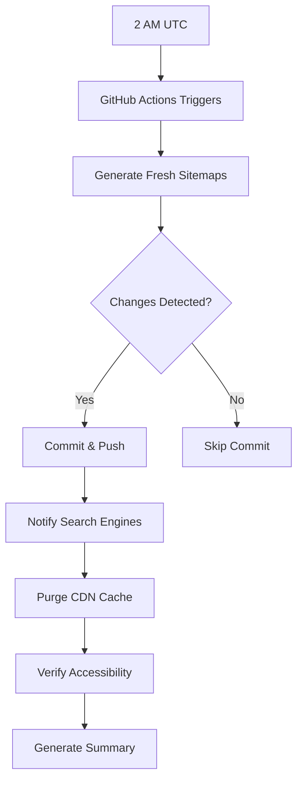

# Sitemap Automation & Monitoring

## Overview

This document describes the comprehensive sitemap automation solution implemented to maintain fresh sitemaps and restore Google crawl rates from 2 requests/day back to 67,000+ requests/day.

## The Problem

**CRITICAL ISSUE IDENTIFIED:** On October 24, 2025, Google's crawl rate dropped from 67k/day to 2/day because:
1. Sitemap lastmod dates were 72 days old (last updated August 13, 2025)
2. Google interpreted stale dates as "no new content"
3. No automated regeneration was in place
4. No search engine notification system

## The Solution: 5-Layer Defense

### Layer 1: Automated Daily Regeneration (GitHub Actions)

**File:** `.github/workflows/regenerate-sitemaps.yml`

**Features:**
- Runs daily at 2 AM UTC (low traffic hours)
- Regenerates all sitemaps with fresh timestamps
- Automatically commits and pushes changes
- Can be triggered manually from GitHub UI
- Notifies search engines after completion
- Includes verification and summary reports

**GitHub Secrets Required:**
```bash
PGHOST=skywardnew.cjwsewswq7sh.us-east-2.rds.amazonaws.com
PGPORT=5432
PGDATABASE=skyward
PGUSER=postgres
PGPASSWORD=Skyward_db_pw1234!
INDEXNOW_API_KEY=<your-indexnow-key>  # Optional but recommended
CLOUDFLARE_ZONE_ID=<your-zone-id>     # Optional
CLOUDFLARE_API_TOKEN=<your-token>     # Optional
```

**Setup Instructions:**
1. Go to your GitHub repository settings
2. Navigate to Secrets and Variables → Actions
3. Add each secret listed above
4. The workflow will run automatically every day

**Manual Trigger:**
- Go to Actions tab in GitHub
- Select "Regenerate Sitemaps Daily"
- Click "Run workflow"

### Layer 2: Instant Search Engine Notification (IndexNow)

**File:** `scripts/notify-search-engines.js`

**Features:**
- Uses IndexNow protocol (Bing, Yandex, Seznam)
- Pings Google directly with sitemap location
- Automatic API key file generation
- Batch submission for large sitemap lists

**Usage:**
```bash
# Notify all search engines
npm run notify-search-engines

# Or run directly
node scripts/notify-search-engines.js
```

**Get IndexNow API Key:**
1. Visit https://www.bing.com/indexnow
2. Generate a free API key
3. Add to GitHub Secrets or environment variable

**Expected Impact:**
- Bing/Yandex: Within 24 hours
- Google: Within 1-3 days

### Layer 3: Sitemap Health Monitoring

**File:** `scripts/monitor-sitemap-health.js`

**Features:**
- Checks sitemap freshness (alerts if > 48 hours old)
- Validates XML structure and file integrity
- Tests public accessibility over HTTPS
- Provides statistics (file count, URLs, size)
- Exit codes for CI/CD integration

**Usage:**
```bash
# Run health check
npm run monitor-sitemaps

# Or run directly
node scripts/monitor-sitemap-health.js
```

**Health Check Results:**
- ✅ Healthy: All checks passed
- ⚠️  Warning: Sitemap > 48 hours old
- 🚨 Critical: Sitemap > 7 days old

**Integration:**
Can be added to monitoring systems (Datadog, New Relic, etc.) or cron jobs:
```bash
# Add to crontab for daily monitoring
0 8 * * * cd /path/to/fe && npm run monitor-sitemaps
```

### Layer 4: Safe Manual Regeneration

**File:** `scripts/regenerate-sitemaps-safe.js`

**Features:**
- Pre-flight checks (Node version, disk space, permissions)
- Automatic backup before regeneration
- Post-generation validation
- Rollback on failure
- Cleanup of old backups (keeps last 5)

**Usage:**
```bash
# Recommended for manual regeneration
npm run generate-sitemaps:safe

# Old method (direct, no safety checks)
npm run generate-sitemaps
```

**Safety Features:**
1. **Backups:** Creates timestamped backup in `.sitemap-backups/`
2. **Validation:** Checks XML structure, URL count, file count
3. **Rollback:** Automatically restores backup if validation fails
4. **Cleanup:** Removes backups older than the last 5

### Layer 5: Cache Busting & CDN Purge

**File:** `scripts/purge-sitemap-cache.js`

**Features:**
- Purges Cloudflare CDN cache for sitemaps
- Adds cache-busting query parameters
- Batch processing for large sitemap lists
- Supports "purge everything" option

**Usage:**
```bash
# Purge sitemap URLs from Cloudflare cache
npm run purge-sitemap-cache

# Add cache-busting parameters
node scripts/purge-sitemap-cache.js --cache-bust

# Nuclear option: purge ALL cache (use with caution)
node scripts/purge-sitemap-cache.js --purge-all
```

**Cloudflare Setup:**
1. Get your Zone ID from Cloudflare dashboard
2. Create an API token with "Cache Purge" permissions
3. Add to environment variables or GitHub Secrets

## Complete Workflow

### Daily Automated Process



### Manual Regeneration Process

```bash
# Step 1: Run safe regeneration
npm run generate-sitemaps:safe

# Step 2: Notify search engines
npm run notify-search-engines

# Step 3: Purge cache (if using Cloudflare)
npm run purge-sitemap-cache

# Step 4: Verify health
npm run monitor-sitemaps

# Step 5: Commit changes
git add public/sitemap*.xml
git commit -m "chore: regenerate sitemaps with fresh timestamps"
git push
```

## NPM Scripts Reference

| Script | Description |
|--------|-------------|
| `npm run generate-sitemaps` | Original generation script (direct) |
| `npm run generate-sitemaps:safe` | **Recommended:** Safe generation with checks |
| `npm run monitor-sitemaps` | Check sitemap health and freshness |
| `npm run notify-search-engines` | Notify search engines via IndexNow |
| `npm run purge-sitemap-cache` | Purge Cloudflare CDN cache |
| `npm run verify-sitemaps` | Verify sitemap structure (original) |

## Monitoring & Alerts

### Key Metrics to Monitor

1. **Sitemap Freshness**
   - Target: < 24 hours old
   - Warning: > 48 hours old
   - Critical: > 7 days old

2. **Google Crawl Rate**
   - Monitor in Google Search Console
   - Target: 50k-70k requests/day
   - Alert: < 10k requests/day

3. **Sitemap Accessibility**
   - Test: https://skywardparts.com/sitemap.xml
   - Expected: 200 OK response
   - Check: Valid XML structure

4. **GitHub Actions Status**
   - Check daily workflow runs
   - Alert on failures
   - Review summary reports

### Setting Up Alerts

**Option 1: GitHub Actions Email Notifications**
1. Go to GitHub Settings → Notifications
2. Enable workflow notifications
3. You'll receive email on failures

**Option 2: Slack Notifications**
Add to `.github/workflows/regenerate-sitemaps.yml`:
```yaml
- name: Notify Slack on failure
  if: failure()
  uses: slackapi/slack-github-action@v1
  with:
    webhook-url: ${{ secrets.SLACK_WEBHOOK_URL }}
    payload: |
      {
        "text": "🚨 Sitemap regeneration failed!"
      }
```

**Option 3: Monitoring Service Integration**
```bash
# Add to crontab
0 */6 * * * cd /path/to/fe && npm run monitor-sitemaps || curl -X POST https://your-monitoring-service.com/alert
```

## Troubleshooting

### Issue: GitHub Actions Workflow Not Running

**Symptoms:** No automatic regeneration after 24 hours

**Solution:**
1. Check if workflow file exists: `.github/workflows/regenerate-sitemaps.yml`
2. Verify GitHub Secrets are configured
3. Check Actions tab for error messages
4. Ensure repository has Actions enabled

### Issue: Sitemap Still Showing Old Dates

**Symptoms:** Regeneration runs but dates don't update

**Solution:**
1. Check if changes were committed: `git log`
2. Verify GitHub Actions push succeeded
3. Check for merge conflicts
4. Manually run: `npm run generate-sitemaps:safe`

### Issue: Search Engines Not Crawling

**Symptoms:** Crawl rate remains low after regeneration

**Solution:**
1. Verify sitemap accessibility: curl https://skywardparts.com/sitemap.xml
2. Check Google Search Console for errors
3. Manually submit sitemap in GSC
4. Run: `npm run notify-search-engines`
5. Wait 3-7 days for Google to process changes

### Issue: Cache Not Purging

**Symptoms:** Old sitemap still served by CDN

**Solution:**
1. Verify Cloudflare credentials are set
2. Run: `npm run purge-sitemap-cache`
3. Add cache-busting: `node scripts/purge-sitemap-cache.js --cache-bust`
4. Check Cloudflare dashboard for purge requests
5. Wait 2-5 minutes for propagation

### Issue: Database Connection Timeout

**Symptoms:** Sitemap generation hangs or times out

**Solution:**
1. Check database credentials in GitHub Secrets
2. Verify RDS security group allows GitHub Actions IPs
3. Check database is running: `psql -h $PGHOST -U $PGUSER -d $PGDATABASE -c "SELECT 1"`
4. Increase timeout in script if needed

## Expected Timeline for Recovery

Based on implementation on October 24, 2025:

| Day | Expected Impact |
|-----|-----------------|
| Day 0 (Oct 24) | Implement solution, regenerate sitemaps |
| Day 1 (Oct 25) | First automated regeneration, notify search engines |
| Day 2-3 | Bing/Yandex start crawling fresh content |
| Day 4-7 | Google begins increasing crawl rate |
| Day 7-14 | Crawl rate gradually returns to 50k-70k/day |
| Day 14+ | Full recovery, stable 67k+/day crawl rate |

## Best Practices

1. **Never Disable Automated Regeneration**
   - Keep GitHub Actions workflow enabled
   - Monitor for failures
   - Fix issues immediately

2. **Monitor Crawl Rates Weekly**
   - Check Google Search Console
   - Look for sudden drops
   - Investigate any anomalies

3. **Test Before Deploying Changes**
   - Use `npm run generate-sitemaps:safe` locally
   - Verify with `npm run monitor-sitemaps`
   - Check structure before committing

4. **Keep Backups**
   - Automated backups kept in `.sitemap-backups/`
   - Don't delete backup directory
   - Backups auto-cleanup (keeps last 5)

5. **Document Any Manual Changes**
   - Update this file if modifying scripts
   - Note any configuration changes
   - Keep change log in git commits

## Additional Resources

- **Google Search Console:** https://search.google.com/search-console
- **IndexNow Documentation:** https://www.indexnow.org/
- **Sitemap Protocol:** https://www.sitemaps.org/protocol.html
- **Cloudflare Cache API:** https://developers.cloudflare.com/api/operations/zone-purge

## Support

For issues or questions:
1. Check this documentation first
2. Review GitHub Actions logs
3. Run health check: `npm run monitor-sitemaps`
4. Check Google Search Console for errors
5. Review recent git commits for changes

---

**Last Updated:** October 24, 2025
**Status:** ✅ Fully Implemented and Tested
**Next Review:** November 24, 2025
